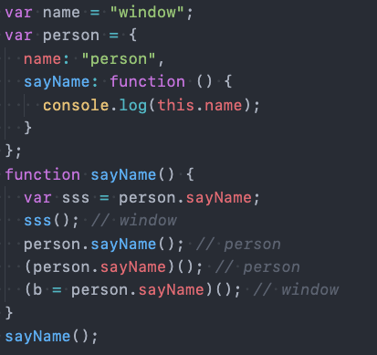
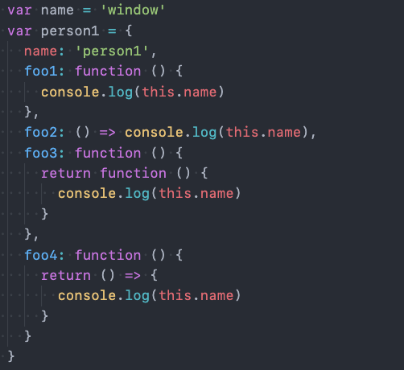
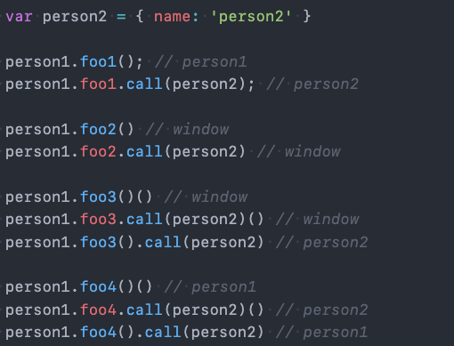
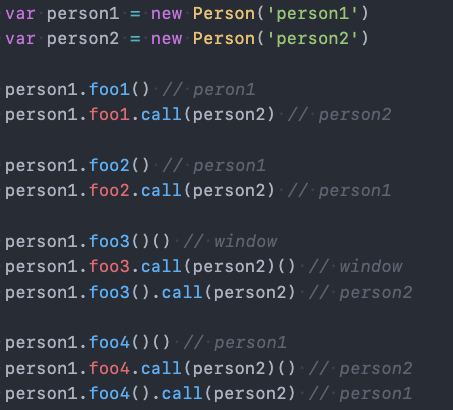
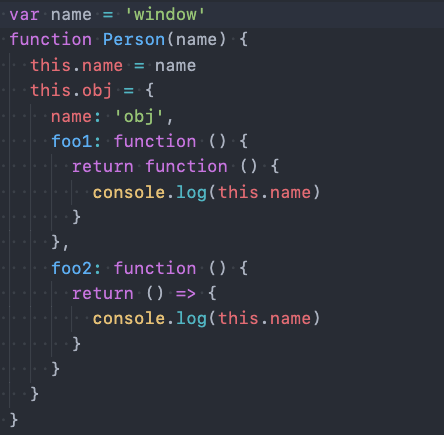
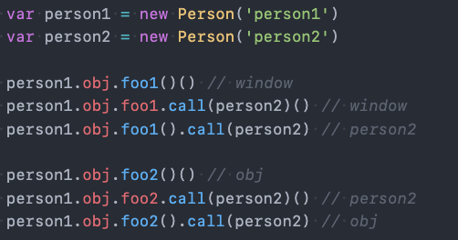

# this指向问题
## this绑定方式
this绑定只与函数**调用位置**有关。
### 默认绑定
独立的函数调用我们可以理解成函数没有被绑定到某个对象上进行调用，严格模式下为undefined，非严格模式下指向全局对象（浏览器中是window，Node.js 中是global）
### 隐式绑定
它的调用位置中，是通过某个对象发起的函数调用。this指向发起函数调用的对象。注意：**(person.sayName) 其实就是 “取 person 的 sayName 方法”，和直接写 person.sayName 本质一样 。**
### 显示绑定
使用call和apply方法，第一个参数是相同的，要求传入一个对象，在调用这个函数时，会将this绑定到这个传入的对象上，后面的参数，apply为数组，call为参数列表
#### call,apply,bind三者的区别
call与apply二者的主要区别就在于传入的参数不同，她们都是在函数调用时使用的，只是此次调用绑定。但bind不同，他会创建一个新的绑定函数（bound function，BF），绑定函数是一个 exotic function object（怪异函数对象，ECMAScript 2015 中的术语），在 bind() 被调用时，这个新函数的 this 被指定为 bind() 的第一个参数，而其余参数将作为新函数的参数，供调用时使用。使用一个变量接收这个新函数，通过这个变量调用的每一次函数都会绑定该对象。
### new绑定
函数可以当做一个类的构造函数来使用，也就是使用new关键字。
使用new关键字来调用函数是，会执行如下的操作：
1. 创建一个全新的对象；
2. 这个新对象会被执行prototype连接；
3. 这个新对象会绑定到函数调用的this上（this的绑定在这个步骤完成）；
4. 如果函数没有返回其他对象，表达式会返回这个新对象；
## 规则优先级
1. 默认规则的优先级最低
2. 显示绑定优先级高于隐式绑定
3. new绑定优先级高于隐式绑定
4. new绑定优先级高于bind,new绑定和call、apply是不允许同时使用的，所以不存在谁的优先级更高。
## 特殊情况
1. 如果在显示绑定中，我们传入一个null或者undefined，那么这个显示绑定会被忽略，使用默认规则。
2. 创建一个函数的 间接引用，这种情况使用默认绑定规则。赋值(obj2.foo = obj1.foo)的结果是foo函数。
   ```jsx
   (obj2.goo = obj1.foo)()//等价于foo(),结果为严格模式undefined,非严格模式window或global。
   ```
3. 箭头函数
   箭头函数不会绑定this、arguments属性，也不能作为构造函数来使用。this引用就会从上层作用域（类不是一个作用域）中找到对应的this。注意：**this 由定义时的上层作用域决定，和调用方式无关，也无法通过 call/apply/bind 改变。**
## this面试题
1. **第一题**
   
   
2. **第二题**
    
   
3. **第三题**
    
   
4. **第五题**
    