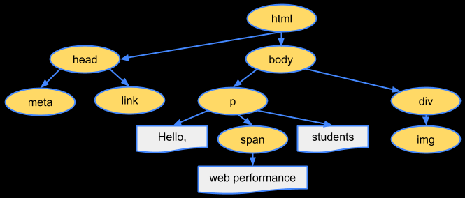
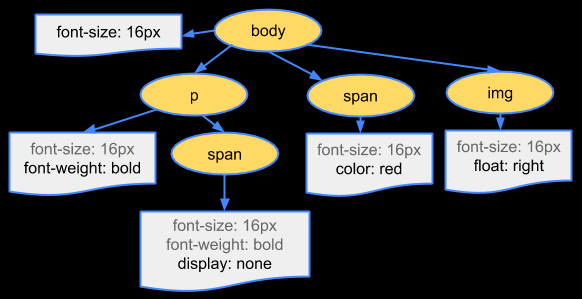
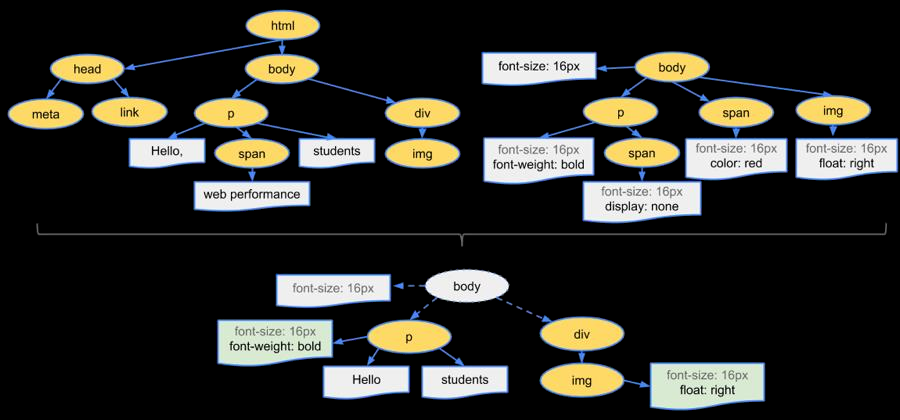

# 浏览器渲染原理

## 浏览器渲染过程

1. 默认情况下服务器会给浏览器返回 index.html 文件，所以解析 HTML 是所有步骤的开始，解析 HTML，会构建 DOM Tree。
   
2. 在解析的过程中，如果遇到 CSS 的 link 元素，那么会由浏览器负责下载对应的 CSS 文件（注意：下载 CSS 文件是不会影响 DOM 的解析的）浏览器下载完 CSS 文件后，就会对 CSS 文件进行解析，解析出对应的**规则树**，我们可以称之为 CSSOM（CSS Object Model，CSS 对象模型）
   
3. 当有了 DOM Tree 和 CSSOM Tree 后，就可以两个结合来构建 Render Tree 了
   
   注意：
   1. link 元素不会阻塞 DOM Tree 的构建过程，但是会阻塞 Render Tree 的构建过程，因为 Render Tree 在构建时，需要对应的 CSSOM Tree。
   2. Render Tree 和 DOM Tree 并不是一一对应的关系，比如对于 display 为 none 的元素，压根不会出现在 render tree 中。
4. 在渲染树（Render Tree）上运行布局（Layout）以计算每个节点的几何体。渲染树会表示显示哪些节点以及其他样式，但是不表示每个节点的尺寸、位置等信息，布局是确定呈现树中所有节点的宽度、高度和位置信息。
5. 将每个节点绘制（Paint）到屏幕上，在绘制阶段，浏览器将布局阶段计算的每个 frame 转为屏幕上实际的像素点，将元素的可见部分进行绘制，比如文本、颜色、边框、阴影、替换元素（比如 img）。

## 回流和重绘

### 回流

也可以称之为重排，第一次确定节点的大小和位置，称之为**布局（layout）**。之后对节点的大小、位置修改重新计算称之为**回流**。
引起回流的条件：

1. DOM 结构发生改变（添加新的节点或者移除节点）。
2. 改变了布局（修改了 width、height、padding、font-size 等值）。
3. 窗口 resize（修改了窗口的尺寸等）。
4. 调用 getComputedStyle 方法获取尺寸、位置信息。

### 重绘

第一次渲染内容称之为绘制（paint），之后重新渲染称之为重绘。
引起重绘的条件：
修改背景色、文字颜色、边框颜色、样式等
**回流一定会引起重绘**，所以回流是一件很消耗性能的
事情，要尽量避免。
避免方式：

1. 修改样式时尽量一次性修改（比如通过 cssText 修改，比如通过添加 class 修改）
2. 尽量避免频繁的操作 DOM（可以在一个 DocumentFragment 或者父元素中将要操作的 DOM 操作完成，再一次性的操作）
3. 尽量避免通过 getComputedStyle 获取尺寸、位置等信
   息。
4. 对某些元素使用 position 的 absolute 或者 fixed（并不是不会引起回流，而是开销相对较小，不会对
   其他元素造成影响。）这里的开销较小的原因在于，当浏览器检测到某个元素大小或位置发生变化时，会检查他周围的元素，并标记被影响的元素为“脏元素”，重新计算这些元素的位置与大小信息。对于脱标元素，浏览器会默认减少布局检查的范围，避免无意义的 “脏元素” 标记。而且脱标的元素与标准流不在一个图层，图层分离后，合成器（Compositor）可以独立处理该图层的绘制，减少与其他图层的依赖关系。

## 图层 composite 合成

绘制的过程，可以将布局后的元素绘制到多个合成图层中。这是浏览器的一种优化手段。默认情况下，标准流中的内容都是被绘制在同一个图层（Layer）中的，而一些特殊的属性，会创建一个新的合成层（CompositingLayer ），并且因为每个合成层都是单独渲染的，新的图层可以利用 GPU 来加速绘制。
可以形成新的合成层的常见属性：

1. 3D transforms
2. video、canvas、iframe
3. opacity 动画转换时
4. position: fixed
5. will-change：一个实验性的属性，提前告诉浏览器元素可能发生哪些变化.
6. nimation 或 transition 设置了 opacity、transform.
   注意：分层确实可以提高性能，但是它以内存管理为代价，因此不应作为 web 性能优化策略的一部分过度使用。

## script 元素和页面解析的关系

浏览器在解析 HTML 的过程中，遇到了 script 元素是不能继续构建 DOM 树的；它会停止继续构建，首先下载 JavaScript 代码，并且执行 JavaScript 的脚本；只有等到 JavaScript 脚本执行结束后，才会继续解析 HTML，构建 DOM 树；因为 JavaScript 的作用之一就是操作 DOM，并且可以修改 DOM；如果我们等到 DOM 树构建完成并且渲染再执行 JavaScript，会造成严重的回流和重绘，影响页面的性能；所以会在遇到 script 元素时，优先下载和执行 JavaScript 代码，再继续构建 DOM 树；
但是在目前的开发模式中（比如 Vue、React），脚本往往比 HTML 页面更“重”，处理时间需要更长，会造成页面的解析阻塞，在脚本下载、执行完成之前，用户在界面上什么都看不到。以下有两个 script 元素属性可以帮助解决这个问题。

### defer 属性

告诉浏览器不要等待脚本下载，而继续解析 HTML，构建 DOM Tree，如果脚本提前下载好了，它会等待 DOM Tree 构建完成，在 DOMContentLoaded 事件之前先执行 defer 中的代码，所以 DOMContentLoaded 总是会等待 defer 中的代码先执行完成。多个带 defer 的脚本是可以保持正确的顺序执行的。defer 可以提高页面的性能，并且推荐放到 head 元素中。注意：defer 仅适用于外部脚本，对于 script 默认内容会被忽略。

### async 属性

async 让一个脚本完全独立，浏览器不会因 async 脚本而阻塞，async 脚本不能保证顺序，它是独立下载、独立运行，不会等待其他脚本。

### 二者使用场景

**defer**通常用于需要在文档解析后操作 DOM 的 JavaScript 代码，并且对多个 script 文件有顺序要求的；
**async**通常用于独立的脚本，对其他脚本，甚至 DOM 没有依赖的；
