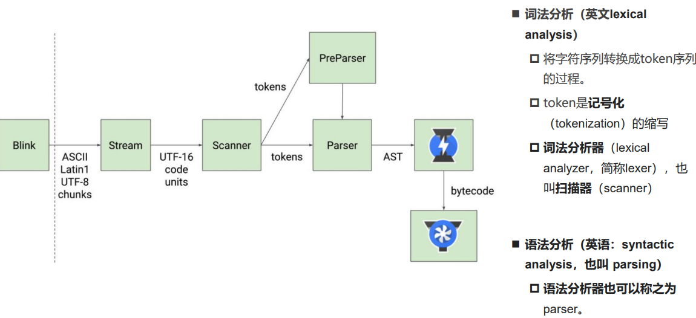
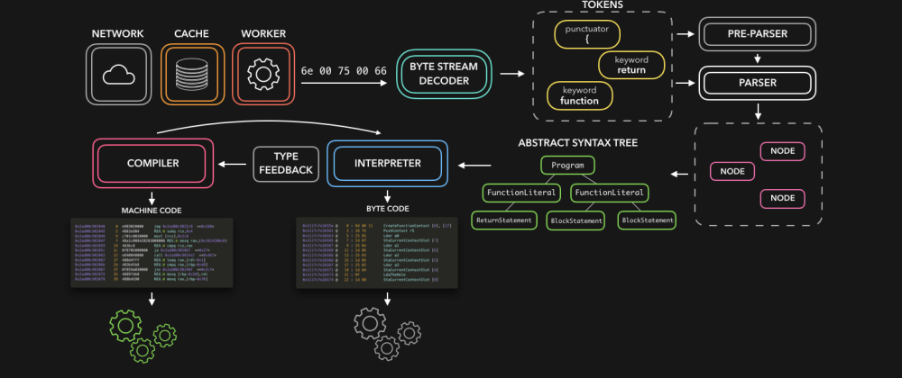

# js运行原理
JavaScript代码下载好之后，是如何一步步被执行的呢？
浏览器内核是由两部分组成的，以webkit为例：
**WebCore**：负责HTML解析、布局、渲染等等相关的工作；
**JavaScriptCore**：解析、执行JavaScript代码；
## v8引擎
V8是用C ++编写的Google开源高性能JavaScript和WebAssembly引擎，它用于Chrome和Node.js等。可以独立运行，也可以嵌入到任何C ++应用程序中。
### v8引擎架构
1. **Parse模块**会将JavaScript代码转换成AST（抽象语法树），这是因为解释器并不直接认识JavaScript代码，如果函数没有被调用，那么是不会被转换成AST的。
2. **Ignition**是一个解释器，会将AST转换成ByteCode（字节码），同时会收集TurboFan优化所需要的信息（比如函数参数的类型信息，有了类型才能进行真实的运算），如果函数只调用一次，Ignition会解释执行ByteCode。
3. **TurboFan**是一个编译器，可以将字节码编译为CPU可以直接执行的机器码。如果一个函数被多次调用，那么就会被标记为**热点函数**，那么就会经过TurboFan转换成优化的机器码，提高代码的执行性能。机器码实际上也会被还原为ByteCode，如果后续执行函数的过程中，**类型发生了变化**（比如sum函数原来执
行的是number类型，后来执行变成了string类型），之前优化的机器码并不能正确的处理运算，就会逆向的转换成字节码。

## JavaScript的执行过程
1. 初始化全局对象
   js引擎会在执行代码之前，会在**堆内存**中创建一个全局对象：Global Object（GO），该对象所有的作用域（scope）都可以访问，里面会包含Date、Array、String、Number、setTimeout、setInterval等等，其中还有一个window属性指向自己；
2. 执行上下文（ Execution Contexts ）
   js引擎内部有一个执行上下文栈（Execution Context Stack，简称ECS），它是用于执行代码的调用栈。首先执行的是全局的代码块，全局的代码块为了执行会构建一个 Global Execution Context（GEC），GEC会被放入到ECS中执行。GEC被放入到ECS中里面包含两部分内容：**第一部分**：在代码执行前，在parser转成AST的过程中，会将全局定义的变量、函数（函数被解析时就会创建一个函数对象，但如果函数嵌套函数则不会创建内层函数对象，只有外层函数被调用时进入外层函数上下文时才会解析内部代码，创建内部函数的对象）等加入到GlobalObject中，但是并不会赋值。这个过程也称之为变量的作用域提升（hoisting）。相当于在运行前解析代码时只关注“定义性”的代码（以let,const,function等开头的那一句），不关注定义内部的代码或执行代码。**第二部分**：在代码执行中，对变量赋值，或者执行其他的函数。
3. VO对象（Variable Object）
   每一个执行上下文会关联一个VO（Variable Object，变量对象），变量和函数声明会被添加到这个VO对象中。当全局代码被执行的时候，VO就是GO对象了。
### 函数执行过程
在执行的过程中执行到一个函数时，就会根据函数体创建一个函数执行上下文（Functional Execution Context，简称FEC），并且压入到EC Stack中。当进入一个函数执行上下文时，会创建一个AO对象（Activation Object），这个AO对象会使用arguments作为初始化，并且初始值是传入的参数，这个AO对象会作为执行上下文的VO来存放变量的初始化。在执行代码遇到变量时，会优先在自己的VO里查找，如果找不到，会在沿着作用域链向上层查找（就是定义函数时的外层作用域的VO）
### 作用域和作用域链（Scope Chain）
作用域链是一个对象列表，用于变量标识符的求值，当进入一个执行上下文时，这个作用域链被创建，并且根据代码类型，添加一系列的对象。对于一个函数，其实在函数被创建时就会确定他的作用域链（也就是说，函数的作用域链只与函数定义的位置有关而与何时调用无关）。
