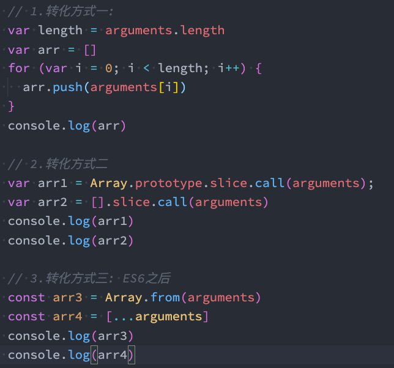
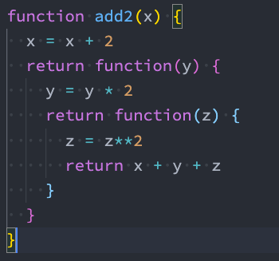
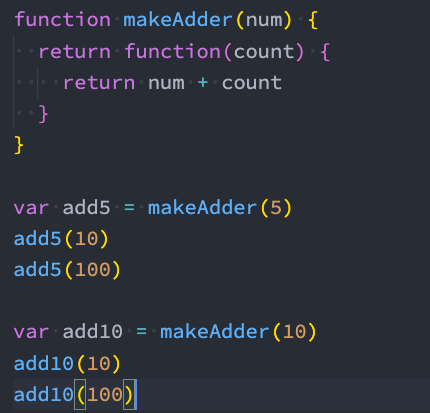
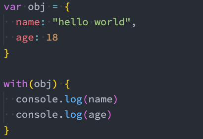
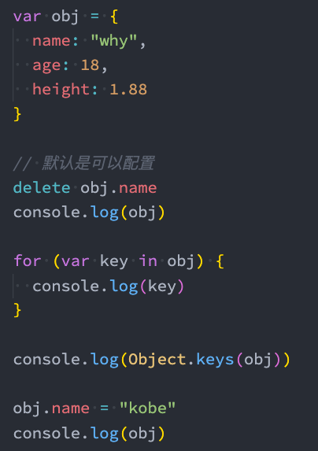
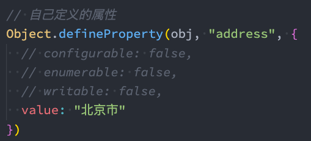
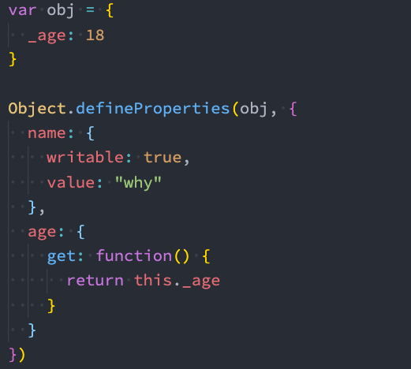

# 函数与对象增强
## 函数
### 函数对象的属性
JavaScript中函数也是一个对象，那么对象中就可以有属性和方法。
1. **name**：一个函数的名词我们可以通过name来访问
   ```jsx
   function foo() {
   }
   const bar = () => {}
   console.log(foo.name,bar.name)//foo bar
   ```
2. **length**:返回函数必传参数的个数（有默认值和剩余参数不计数）
   ```jsx
   const bar = (name,age,...args) => {}
   console.log(bar.length)//2
   ```
### arguments
一个对应于传递给函数的参数的类数组(array-like)对象,注意，现在已经不常使用了，用**剩余参数**替代。
```jsx
function foo(x,y,z) {
    console.log(arguments)
}
foo(10,20,30)//{"0": 10,"1": 20,"2": 30}
```
array-like意味着它不是一个数组类型，而是一个对象类型,但是它却拥有数组的一些特性，比如说length，比如可以通过index索引来访问,只是没有数组的一些方法，比如filter、map等。
因此，我们经常需要将arguments转成Array，以便使用数组的一些特性，以下有三种转化方法：
1. 遍历arguments，添加到一个新数组中。
2. 调用数组slice函数的call方法。（slice方法其实就是用内部指针this指向数组对象处理，本方法显示绑定this到arguments使slice操作arguments继而生成新数组）
3. Array.from(arguments)或者[…arguments]

**补充slice与splice区别**:
1. slice(start, end)：用于提取数组的一部分，会返回一个新数组，不会对原数组进行修改。（是一个纯函数）
2. splice(start, deleteCount, item1, ...)：主要用于对数组进行删除、插入或替换操作，会直接修改原数组，并返回被删除的元素所组成的数组。（操作数组的利器）
**箭头函数与剩余参数**
箭头函数是不绑定arguments的，所以我们在箭头函数中使用arguments会去上层作用域查找，就是与this一样。
箭头函数使用剩余参数接收不定量的参数，并且作为一个数组（剩余参数必须放到最后一个位置，否则会报错。）：
```jsx
function foo(m,n,...args) {
    console.log(m,n)
    console.log(args)//数组
}
```
**剩余参数和arguments区别**
1. 剩余参数只包含那些没有对应形参的实参，而 arguments 对象包含了传给函数的所有实参.
2. arguments对象不是一个真正的数组，而rest参数是一个真正的数组，可以进行数组的所有操作.
3. rest参数是ES6中提供并且希望以此
来替代arguments的.
### 纯函数
维基百科关于纯函数的定义：
在程序设计中，若一个函数符合以下条件，那么这个函数被称为纯函数：
1. 此函数在相同的输入值时，需产生相同的输出。
2. 函数的输出和输入值以外的其他隐藏信息或状态无关，也和由I/O设备产生的外部输出无关。
3. 该函数不能有语义上可观察的函数副作用，诸如“触发事件”，使输出设备输出，或更改输出值以外物件的内容等。
简单来说，有两个要求：
1. 确定的输入，一定会产生确定的输出（就是不受外部变量的影响或者说函数内部不使用外部变量，闭包就是典型的非纯函数）
2. 函数在执行过程中，不能产生**副作用**（就是函数不影响外部，不修改外部的任何东西而只产生返回值）。
### 副作用
表示在执行一个函数时，除了返回函数值之外，还对调用函数产生了附加的影响，比如修改了全局变量，修改参数或者改变外部的存储；副作用往往是产生bug的 “温床”。对于一些第三方库，若是产生了副作用，我们很难去排错所以多使用纯函数。**写的时候**保证了函数的纯度，只是单纯实现自己的业务逻辑即可，不需要关心传入的内容是如何获得的或者依赖其他的外部变量是否已经发生了修改；**用的时候**你确定你的输入内容不会被任意篡改，并且自己确定的输入，一定会有确定的输出
### 柯里化
是一种关于函数的高阶技术，维基百科定义如下：
是把接收多个参数的函数，变成接受一个单一参数（最初函数的第一个参数）的函数，并且返回接受余下的参数，而且返回结果的新函数的技术；柯里化声称 “如果你固定某些参数，你将得到接受余下参数的一个函数”；
**简单来说**就是：只传递给函数一部分参数来调用它，让它返回一个函数去处理剩余的参数，这个过程就称之为柯里化。将一个函数从可调用的 f(a, b, c) 转换为可调用的 f(a)(b)(c)。**注意**：柯里化不会调用函数。它只是对函数进行转换。
#### 柯里化的优势
1. 在函数式编程中，我们其实往往希望一个函数处理的问题尽可能的单一，而不是将一大堆的处理过程交给一个函数来处理。而使用柯里化可以将每次传入的参数在单一的函数中进行处理，处理完后在下一个函数中再使用处理后的结果。
   

2. 可以复用参数逻辑：例如makeAdder函数要求我们传入一个num（并且如果我们需要的话，可以在这里对num进行一些修改）；在之后使用返回的函数时，我们不需要再继续传入num了；
   

#### 自动柯里化函数
```jsx
function hyCurrying(fn) {
    function curried(...args) {
        if(args.length >= fn.length) {
            return fn.apply(this,args)//如果第一次传入的参数个数就已经满足原函数需要的所有参数，直接调用原函数，这里使用apply调用原函数是因为想同时保证this的指向与外部相同
        } else {
            return (...args2) => {
                return curried.apply(this,args.concat(args2))//写两个函数是因为如果直接返回curried输入参数会覆盖掉原参数。
            }
        }
    }
}
```
```jsx
//不绑定this会出现问题的场景
function sum(a, b) {
  return a + b + this.value; // 依赖this
}

const obj = {
  value: 10,
  curriedSum: hyCurrying(sum) // 使用柯里化函数，hyCurrying(sum)在定义curriedSum时就执行了，返回柯里化后的函数。
};

// 预期输出 10 + 2 + 3 = 15
obj.curriedSum(2)(3); // 错误：this.value 为 undefined
// 这里obj.curriedSum(2)相当于
// curried(2) {
//         if(args.length >= sum.length) {
//             return sum.apply(this,args)
//         } else {
//             return (...args2) => {
//                 return curried.apply(this,args.concat(args2))/
//             }
//         }
//     }
//又因为是对象发起的调用，所以this为obj
```
### 组合函数
**组合（Compose）**函数是在JavaScript开发过程中一种对函数的使用技巧、模式。比如我们现在需要对某一个数据进行函数的调用，执行两个函数fn1和fn2，这两个函数是依次执行的；那么如果每次我们都需要进行两个函数的调用，操作上就会显得重复；将这两个函数组合起来，**自动依次调用**这个过程就是对函数的组合，我们称之为 **组合函数（Compose Function）**。
```jsx
//实现自动组合函数
function compose(...fns) {
    //边界检查是否存在不为函数的参数
    let length = fns.length
    for(let i = 0; i < length; i++) {
        let fn = fns[i]
        if(typeof fn !== 'function') {
            throw new TypeError('Expected a funtion')
        }
    }
    //函数功能部分
    return function(...args) {
        //先获取第一次执行的结果
        let index = 0
        //存在函数就调用，不存在就返回参数
        let result = length ? fns[index].apply(this,args) : args
        while(++index < length) {
            //进入循环代表存在函数，函数只会返回一个值，所以用call
            result = fns[index].call(this,result)
        }
        return result
    }
}
```
### with和eval
二者应用都很少，尤其严格模式下不能使用with.
**with语句** 扩展一个语句的作用域链,不建议使用with语句，因为它可能是混淆错误和兼容性问题的根源.

**eval**是一个特殊的函数，它可以将传入的字符串当做JavaScript代码来运行；eval会将最后一句执行语句的结果，作为返回值；

不建议在开发中使用eval：
1. eval代码的可读性非常的差（代码的可读性是高质量代码的重要原则）；
2. eval是一个字符串，那么有可能在执行的过程中被刻意篡改，那么可能会造成被攻击的风险；
3. eval的执行必须经过JavaScript解释器，不能被JavaScript引擎优化；

### 严格模式
是一种具有限制性的JavaScript模式，从而使代码隐式的脱离了 ‘懒散（sloppy）模式’；支持严格模式的浏览器在检测到代码中有严格模式时，会以更加严格的方式对代码进行检测和执行。
严格语法限制：
1. 无法意外的创建全局变量
2. 严格模式会使引起静默失败(silently fail,注:不报错也没有任何效果)的赋值操作抛出异常。如严格模式下试图删除不可删除的属性会报错。
3. 严格模式不允许函数参数有相同的名称。
4. 不允许0的八进制语法。
5. 在严格模式下，不允许使用with。
6.  在严格模式下，eval不再为上层引用变量。（就是在eval里定义的变量不能被后续代码使用）。

## 对象
想要对一个属性进行比较精准的操作控制，那么我们就可以使用**属性描述符**。
属性描述符可以精准的添加或修改对象的属性，使用 Object.defineProperty 来对属性进行添加或者修改。
Object.defineProperty() 方法会直接在一个对象上定义一个新属性，或者修改一个对象的现有属性，并**返回此对象**。
```jsx
Object.defineProperty(obj对象名,prop属性名,descriptor属性描述符)
```
### 数据属性描述符
1. **Configurable**：属性是否可以通过delete删除属性，是否可以修改它的特性，或者是否可以将它修改为存取属性描述符。
2. **Enumerable**：属性是否可以通过for-in或者Object.keys()返回该属性。
3. **Writable**：是否可以修改属性的值。
4. **value**：属性的value值，读取属性时会返回该值，修改属性时，会对其进行修改。
```jsx
let obj = {
    name:"zmy",
    age:18,
    height:1.62,
}
delete obj.name
console.log(obj)//{age:18,height:1.62,}
Object.defineProperty(obj,'age',{
    configurable:false
})
delete obj.age
console.log(obj)//{age:18,height:1.62,}修改无效并且在严格模式下会报错。
```
一些示例：


### 存取属性描述符
1. **Configurable**：表示属性是否可以通过delete删除属性，是否可以修改它的特性，或者是否可以将它修改为存取属性描述符。
2. **Enumerable**：表示属性是否可以通过for-in或者Object.keys()返回该属性。
3. **get**：获取属性时会执行的函数。默认为undefined。
4. **set**：设置属性时会执行的函数。默认为undefined。
```jsx
 let obj = {
            name: "zmy",
            _age: 18,
            height: 1.62,
        }

        Object.defineProperty(obj, 'age', {
            get: function () {
                console.log('读取了age')
                return this._age || 0 // 使用一个内部属性存储值
            },
            set: function (value) {
                console.log('修改了age')
                this._age = value
                console.log(value)
            },
            enumerable: true,
            configurable: true
        })

        console.log(obj.age) // 读取了age, 18
        obj.age = 19         // 修改了age, 19
        console.log(obj.age) // 读取了age, 19
```
**注意**：
所有正常定义的属性默认描述符都为true,通过Object.defineProperty定义的属性描述符都默认为false（感觉通过Object.defineProperty定义的属性更加私有，所以默认不可改）
### 同时定义多个属性
Object.defineProperties() 方法直接在一个对象上定义 多个 新的属性或修改现有属性，并且返回该对象。

### 对象方法补充
**获取对象的属性描述符：**
Object.getOwnPropertyDescriptor(obj, propertyName);
Object.getOwnPropertyDescriptors(obj);
**禁止对象扩展新属性：preventExtensions**
Object.preventExtensions(obj);
给一个对象添加新的属性会失败（在严格模式下会报错）；
**密封对象，不允许配置和删除属性：seal**
seal(obj)
实际是调用preventExtensions
并且将现有属性的configurable:false
**冻结对象，不允许修改现有属性：freeze** 
freeze(obj)
实际上是调用seal
并且将现有属性的writable: false
