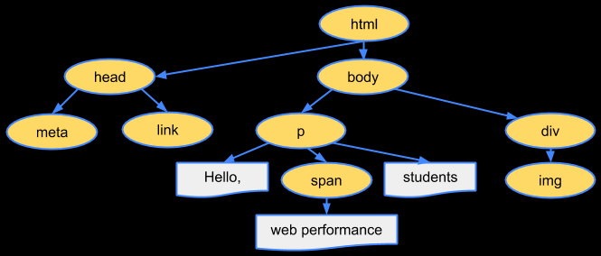
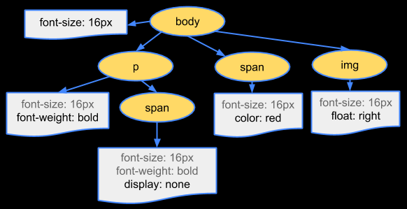
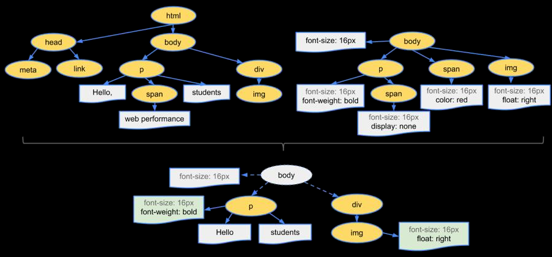

# 浏览器渲染原理
## 浏览器渲染过程
1. 默认情况下服务器会给浏览器返回index.html文件，所以解析HTML是所有步骤的开始，解析HTML，会构建DOM Tree。
   
2. 在解析的过程中，如果遇到CSS的link元素，那么会由浏览器负责下载对应的CSS文件（注意：下载CSS文件是不会影响DOM的解析的）浏览器下载完CSS文件后，就会对CSS文件进行解析，解析出对应的**规则树**，我们可以称之为 CSSOM（CSS Object Model，CSS对象模型）
    
3. 当有了DOM Tree和 CSSOM Tree后，就可以两个结合来构建Render Tree了
   
   注意：
   1. link元素不会阻塞DOM Tree的构建过程，但是会阻塞Render Tree的构建过程，因为Render Tree在构建时，需要对应的CSSOM Tree。
   2. Render Tree和DOM Tree并不是一一对应的关系，比如对于display为none的元素，压根不会出现在render tree中。
4. 在渲染树（Render Tree）上运行布局（Layout）以计算每个节点的几何体。渲染树会表示显示哪些节点以及其他样式，但是不表示每个节点的尺寸、位置等信息，布局是确定呈现树中所有节点的宽度、高度和位置信息。
5. 将每个节点绘制（Paint）到屏幕上，在绘制阶段，浏览器将布局阶段计算的每个frame转为屏幕上实际的像素点，将元素的可见部分进行绘制，比如文本、颜色、边框、阴影、替换元素（比如img）。
## 回流和重绘
### 回流
也可以称之为重排，第一次确定节点的大小和位置，称之为**布局（layout）**。之后对节点的大小、位置修改重新计算称之为**回流**。
引起回流的条件：
1. DOM结构发生改变（添加新的节点或者移除节点）。
2. 改变了布局（修改了width、height、padding、font-size等值）。
3. 窗口resize（修改了窗口的尺寸等）。
4. 调用getComputedStyle方法获取尺寸、位置信息。
### 重绘
第一次渲染内容称之为绘制（paint），之后重新渲染称之为重绘。
引起重绘的条件：
修改背景色、文字颜色、边框颜色、样式等
**回流一定会引起重绘**，所以回流是一件很消耗性能的
事情，要尽量避免。
避免方式：
1. 修改样式时尽量一次性修改（比如通过cssText修改，比如通过添加class修改）
2. 尽量避免频繁的操作DOM（可以在一个DocumentFragment或者父元素中将要操作的DOM操作完成，再一次性的操作）
3. 尽量避免通过getComputedStyle获取尺寸、位置等信
息。
4. 对某些元素使用position的absolute或者fixed（并不是不会引起回流，而是开销相对较小，不会对
其他元素造成影响。）这里的开销较小的原因在于，当浏览器检测到某个元素大小或位置发生变化时，会检查他周围的元素，并标记被影响的元素为“脏元素”，重新计算这些元素的位置与大小信息。对于脱标元素，浏览器会默认减少布局检查的范围，避免无意义的 “脏元素” 标记。而且脱标的元素与标准流不在一个图层，图层分离后，合成器（Compositor）可以独立处理该图层的绘制，减少与其他图层的依赖关系。
## 图层composite合成
绘制的过程，可以将布局后的元素绘制到多个合成图层中。这是浏览器的一种优化手段。默认情况下，标准流中的内容都是被绘制在同一个图层（Layer）中的，而一些特殊的属性，会创建一个新的合成层（CompositingLayer ），并且因为每个合成层都是单独渲染的，新的图层可以利用GPU来加速绘制。
可以形成新的合成层的常见属性：
1. 3D transforms
2. video、canvas、iframe
3. opacity 动画转换时
4. position: fixed
5. will-change：一个实验性的属性，提前告诉浏览器元素可能发生哪些变化.
6. nimation 或 transition 设置了opacity、transform.
注意：分层确实可以提高性能，但是它以内存管理为代价，因此不应作为 web 性能优化策略的一部分过度使用。
## script元素和页面解析的关系
浏览器在解析HTML的过程中，遇到了script元素是不能继续构建DOM树的；它会停止继续构建，首先下载JavaScript代码，并且执行JavaScript的脚本；只有等到JavaScript脚本执行结束后，才会继续解析HTML，构建DOM树；因为JavaScript的作用之一就是操作DOM，并且可以修改DOM；如果我们等到DOM树构建完成并且渲染再执行JavaScript，会造成严重的回流和重绘，影响页面的性能；所以会在遇到script元素时，优先下载和执行JavaScript代码，再继续构建DOM树；
但是在目前的开发模式中（比如Vue、React），脚本往往比HTML页面更“重”，处理时间需要更长，会造成页面的解析阻塞，在脚本下载、执行完成之前，用户在界面上什么都看不到。以下有两个script元素属性可以帮助解决这个问题。
### defer属性
告诉浏览器不要等待脚本下载，而继续解析HTML，构建DOM Tree，如果脚本提前下载好了，它会等待DOM Tree构建完成，在DOMContentLoaded事件之前先执行defer中的代码，所以DOMContentLoaded总是会等待defer中的代码先执行完成。多个带defer的脚本是可以保持正确的顺序执行的。defer可以提高页面的性能，并且推荐放到head元素中。注意：defer仅适用于外部脚本，对于script默认内容会被忽略。
### async属性
async让一个脚本完全独立，浏览器不会因 async 脚本而阻塞，async脚本不能保证顺序，它是独立下载、独立运行，不会等待其他脚本。
### 二者使用场景
**defer**通常用于需要在文档解析后操作DOM的JavaScript代码，并且对多个script文件有顺序要求的；
**async**通常用于独立的脚本，对其他脚本，甚至DOM没有依赖的；

